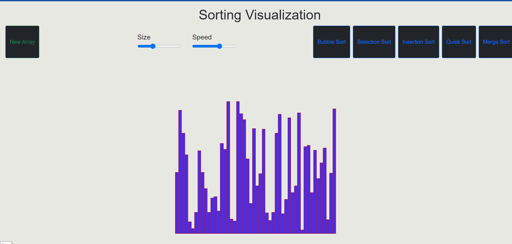
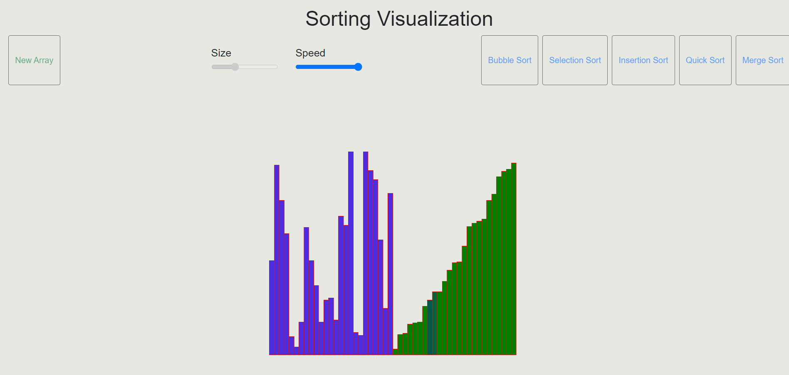
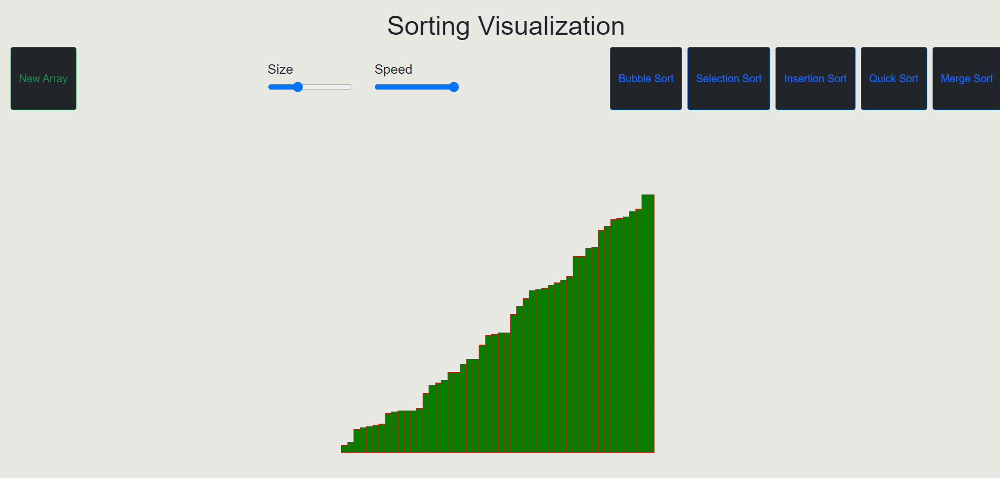

# sorting-visualization
It is a JavaScript application for visualizing various sorting algorithms. Implementations include:Bubble Sort, Merge Sort, Quick Sort, Selection Sort and Insertion Sort with the functionality of  Speed Control and Array Size Control
  
  
  
